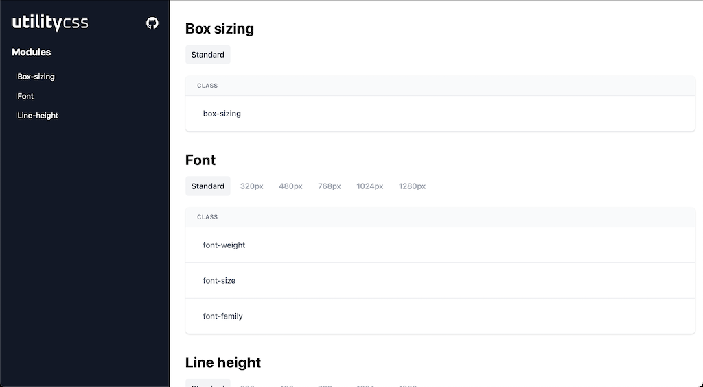

# @utilitycss/electron-doc

A app to auto-generate electron documentation.



### Install dependencies

```bash
yarn
```

### Start app

```bash
yarn start
```

### Production build

```bash
yarn build
```

### Mock data

Mock utility module output can be found in the below folder.

```bash
./src/mocks/module.json
```
